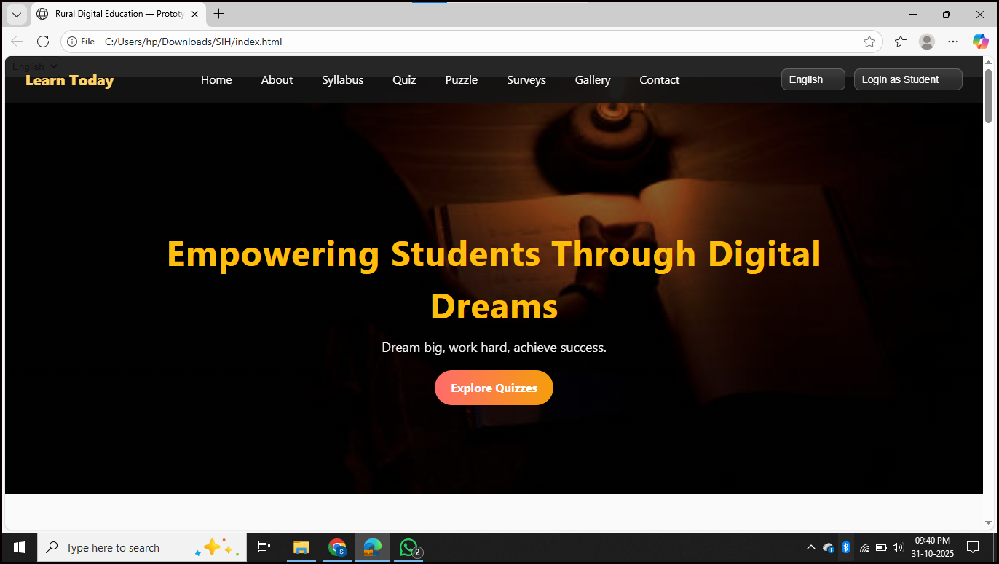
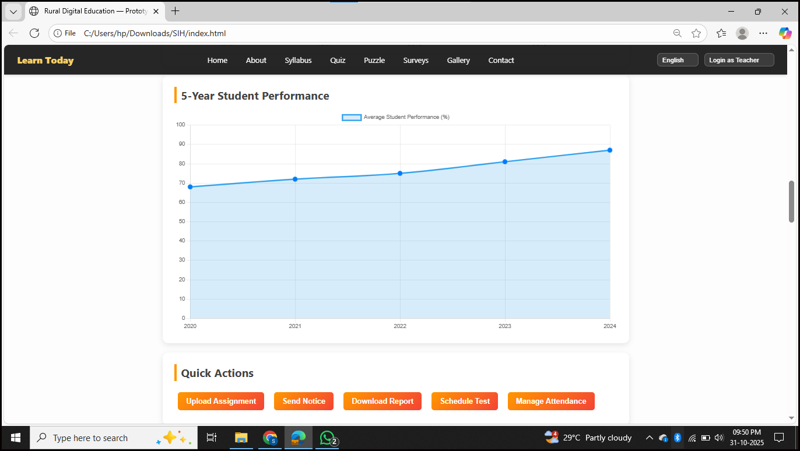

# Digital-Learning-Platform-for-Rural-School-Students

The **Digital Learning Platform for Rural School Students in N.E. Region** is a **web-based and mobile-responsive prototype** designed to make education accessible, engaging, and inclusive for rural and tribal students.  
 
This platform focuses on:
- Delivering **curriculum-based learning modules** in **English and regional languages** (Assamese, Manipuri, Khasi, Mizo, etc.)
- Supporting **low-bandwidth access** and **offline usability**
- Enabling teachers to **track, evaluate, and guide** students remotely
- Providing **interactive and gamified learning** experiences

---

### Key Features

 **Offline & Low Bandwidth Mode**  
Works effectively with unstable internet connections; downloadable content for offline use.  

 **Multilingual Support**  
Supports multiple regional languages to ensure inclusivity and comfort for learners.  

 **Teacher Dashboard**  
Monitors student attendance, performance, and engagement metrics through charts and reports.  

 **Interactive Learning Modules**  
Includes subject-wise quizzes, puzzles, and story-based digital lessons.  

 **AI-Driven Insights (Future Integration)**  
Provides personalized learning paths and adaptive assessments.  

 **Community & Cultural Relevance**  
Includes local examples, art, and culture from North-Eastern states to build relatability.  

---

###  Technologies Used

| Category | Tools / Frameworks |
|-----------|--------------------|
| **Frontend** | HTML, CSS, JavaScript |
| **Visualization** | Chart.js |
| **Database** | Firebase / AWS DynamoDB |
| **AI chatbot** | Chatbot integration using Python APIs |

## System Modules
    1. Student Module — Access quizzes, videos, and offline lessons.
    2. Teacher Dashboard — Track student progress, upload study material, and view analytics.
    3. Admin Panel (Future) — Manage content, users, and school data.
    4. Survey & Feedback Section — Collect insights from users for continuous improvement.

---
## Screenshots 
 

## Developed By

## Team Name: [InspiraX]
## Developer: Sailaja S
## Hackathon: Smart India Hackathon (SIH) 2025
## Problem Statement ID: 25019
## Theme: Digital Learning and Education Accessibility
## Region Focus: North-Eastern States of India
